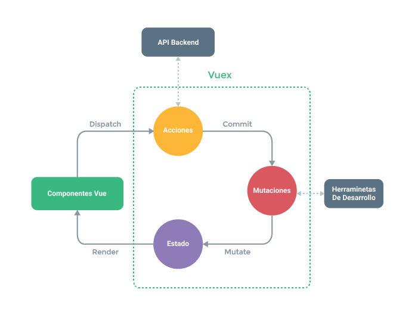

# ¿Qué es Vuex?

Vuex es un **patrón y librería para gestionar el estado** en aplicaciones creadas con Vue.js. Sirve como almacén al que pueden acceder todos los componentes de una aplicación, con normas de acceso que aseguran que el estado solo puede ser modificado de manera predecible. Así mismo, Vuex se integra con la [extensión de desarrollo](https://github.com/vuejs/vue-devtools) oficial de Vue para ofrecer herramientas avanzadas como 'viaje-temporal' de datos sin configuración previa ó importación/exportación de snapshots de estado.

### ¿Qué es un "Patrón de Gestión de Estado"?

Empecemos con un sencillo contador creado con Vue:

``` js
new Vue({
  // estado
  data () {
    return {
      contador: 0
    }
  },
  // vista
  template: `
    <div>{{ contador }}</div>
  `,
  // acciones
  methods: {
    incrementar () {
      this.contador++
    }
  }
})
```

Es una aplicación auto-contenida con las siguientes partes:

- El **estado**, fuente de 'verdad' que conduce nuestra aplicación;
- La **vista**, un sencillo mapeo declarativo de nuestro **estado**;
- Las **acciones**, las cuales muestras las posibles formas de modificar nuestro estado en reacción a eventos del usuario sobre la **vista**.

Ésta es una representación extremadamente sencilla del concepto de "flujo de datos unidireccional":

<p style="text-align: center; margin: 2em">
  
</p>

Sin embargo, la sencillez se desvance rápidamente cuando tenemos **múltiples componentes que comparten estado**:

- Multiples vistas pueden depender de una misma parte del estado.
- Acciones emitidas por distintas vistas pueden tratar de modificar una misma parte del estado.

El primer problema se puede resolver de forma tediosa pasando propiedades (*props*) entre componentes para llegar a aquellos profundamente anidados, solución que no funciona para componentes que coexisten al mismo nivel. En cuanto al segundo problema, a menudo nos vemos recurriendo a soluciones como acceder direcamente a referencias de instancias de padres/hijos o tratando de modificar y sincronizar múltiples copias del estado por medio de eventos. Ambos patrones son fragiles y rápidamente generan código dificil de mantener.

¿Por qué no extraer todo el estado compartido y administrarlo como un singleton global? De esta forma nuestro árbol de componentes se convierte en una gran "vista" con acceso al estado y a acciones, sin importar donde esté el componente.

Adicionalmente, por medio de la definición y separación de conceptos involucrados en la gestión del estado e imponiendo ciertas reglas, le damos a nuestro código una estructura mejor definida y mantenible.

Ésta es la idea básica detrás de Vuex, inspirada por [Flux](https://facebook.github.io/flux/docs/overview.html), [Redux](http://redux.js.org/) y [La Arquitectura Elm](https://guide.elm-lang.org/architecture/). A diferencia de otros patrones, Vuex también es una librería diseñada especificamente para Vue.js buscando sacarle el mayor partido a su sistema de reactividad granular para actualizaciones eficientes.



### ¿Cuándo me conviene usar Vuex?

A pesar de que Vuex nos ayuda en gran medida a gestionar estado compartido tiene un coste. Más conceptos, más código base, ... Es una compensación a hacer entre productividad a corto plazo y largo plazo.

If you've never built a large-scale SPA and jump right into Vuex, it may feel verbose and daunting. That's perfectly normal - if your app is simple, you will most likely be fine without Vuex. A simple [global event bus](http://vuejs.org/v2/guide/components.html#Non-Parent-Child-Communication) may be all you need. But if you are building a medium-to-large-scale SPA, chances are you have run into situations that make you think about how to better handle state outside of your Vue components, and Vuex will be the natural next step for you. There's a good quote from Dan Abramov, the author of Redux:

Si nunca has desarrollado aplicaciones SPA de gran escala y decides apoyarte en Vuex es probable que lo consideres verboso y desalentador. Es perfectamente normal. Si tu aplicación es simple probablemente Vuex no te haga falta y un [bus global de eventos](http://vuejs.org/v2/guide/components.html#Non-Parent-Child-Communication) sea todo lo que necesites. Sin embargo, si estas desarrollando una aplicación SPA de media/gran escala es probable que te hayas topado con situaciones que te hagan pensar en como gestionar el estado de la app fuera de los componentes Vue que lo consumen. En ese caso incorporar Vuex es el paso natural a dar. Hay una cita muy buena de Dan Abramov, author de Redux, que dice:

> Librerias Flux son como vasos: sabrás cuando las necesitas.
